<!-- _class: lead cover -->
<!-- _paginate: false -->

# Triển khai xác thực người nói trên vi điều khiển ESP32-S3 bằng nén mô hình
### Speaker Verification on the ESP32-S3 Microcontroller via Model Compression

**Trần Tú Quang** 250201084 · **Tô Huỳnh Minh Tiến** 250201095 · **Nguyễn Ấn** 250201042

GVHD: ........................

IT2058 · Báo cáo tiến độ đồ án môn học

University of Information Technology, VNU-HCM (UIT) · TP.HCM, 29/09/2026

---

## Giới thiệu đề tài

- **Bối cảnh:** các ứng dụng Edge AI hiện thường chạy trên máy tính nhúng như Jetson Nano, ví dụ điểm danh bằng khuôn mặt [8] và Lite-XNet [9]. Nhóm chọn làm ở lớp thấp hơn là **vi điều khiển ESP32-S3**, giá khoảng 250k, chỉ có **512KB SRAM** và CPU **240MHz**.
- **Bài toán:** xác thực người nói, tức xác định *ai đang nói* và từ chối người lạ. Bài toán này hợp để làm trên thiết bị biên vì dữ liệu giọng nói là dữ liệu sinh trắc không nên gửi lên server, kết quả cần có dưới 1 giây, và hệ thống phải chạy được cả khi mất mạng.
- **Thách thức:** mô hình tốt hiện nay là ECAPA-TDNN [1], khoảng **20 triệu tham số**, không thể nạp vào vi điều khiển. Nhóm phải nén mô hình xuống còn khoảng **300KB** bằng các kỹ thuật của môn học: chưng cất tri thức [4], tỉa kênh [5] và lượng tử hoá INT8 [6].
- **Điểm cần chú ý:** hệ thống quyết định bằng cách **so điểm tương đồng với một ngưỡng**. Sau khi lượng tử hoá, điểm số có thể bị lệch, nên ngưỡng chọn cho bản FP32 có thể không còn đúng với bản INT8. Nhóm sẽ đo và hiệu chuẩn lại ngưỡng.

---

## Mục tiêu đồ án

- **Mục tiêu 1. Triển khai trên ESP32-S3:** nén mô hình xác thực người nói xuống khoảng **300KB INT8** và chạy real-time với micro I2S, trong đó log-mel được tính dạng streaming để không tràn SRAM.
- **Mục tiêu 2. So sánh ba cách nén cùng ngân sách:** chưng cất embedding từ teacher, tỉa kênh rồi tinh chỉnh, và train thẳng mô hình nhỏ làm mốc dưới. Cả ba dùng chung kiến trúc student, quy trình INT8 và board đo.
- **Mục tiêu 3. Đánh giá trên thiết bị:** đo độ chính xác, độ trễ, RAM và điện năng của từng mô hình trên board thật, xem lượng tử hoá INT8 làm giảm chất lượng bao nhiêu và hiệu chuẩn lại ngưỡng để bù.

**Phạm vi:** sản phẩm gồm một hệ thống demo chạy trên ESP32-S3 và bảng đánh giá, chưa phải hệ thống kiểm soát ra vào để dùng thật.

---

## Hướng thực hiện

- **Teacher:** ECAPA-TDNN pretrained (SpeechBrain), chạy trên PC, EER khoảng 1% trên VoxCeleb1-O. Đây là mốc trên.
- **KD:** ép embedding của student bám theo teacher, kết hợp với loss phân loại người nói.
- **Tỉa kênh + FT:** tỉa dần kênh của teacher, đo lại sau mỗi mức rồi tinh chỉnh.
- **Train thẳng:** train student từ đầu bằng AAM-softmax, không dùng teacher. Đây là mốc dưới.
- **INT8 chung:** lượng tử hoá sau huấn luyện, giữ lại cả bản FP32 và INT8 của mỗi đường để tách được hai loại mất mát.

---

## Hệ thống trên thiết bị

**Ràng buộc và cách xử lý**
- 3 giây audio 16kHz dạng float đã chiếm **192KB**, nên phải xử lý streaming theo từng khung
- Trọng số để trong flash, tensor arena trong SRAM, chỉ tràn sang PSRAM khi cần
- FFT dùng ESP-DSP, kernel INT8 dùng ESP-NN

**Phần cứng (~450k)**
- ESP32-S3 N16R8 (16MB flash, 8MB PSRAM) · 250k
- 2 micro INMP441 (I2S) · 100k
- INA219 đo dòng để tính µJ mỗi lần suy luận · 50k
- Breadboard, dây cắm · 50k

---

## Dữ liệu và đánh giá

**Dữ liệu (đều công khai)**
- **VoxCeleb1** [2]: dùng để train, bộ thử là **VoxCeleb1-O** gốc nên so được với số đã công bố
- **MUSAN, RIR:** nhiễu nền ở nhiều mức SNR cố định, vang phòng
- **ASVspoof 2019 PA** [3]: tấn công phát lại

**Độ đo**
- **EER** (chính), **minDCF**, đường **DET**
- **Độ dịch ngưỡng:** FAR và FRR lệch bao nhiêu khi dùng ngưỡng FP32 cho model INT8
- **Trên thiết bị:** kích thước, độ trễ p50/p95, RAM đỉnh, µJ mỗi lần suy luận

**Ma trận thí nghiệm:** 3 cách nén × 2 dạng (FP32, INT8) × 4 điều kiện (sạch, nhiễu, vang, replay). Dùng chung seed và trial list, người nói trong bộ thử không có trong tập train, ngưỡng lấy từ tập val.

---

## Kết quả dự kiến

1. **Hệ thống chạy real-time trên ESP32-S3:** xác thực người nói từ micro I2S với model INT8 khoảng 300KB, kèm số đo độ trễ, RAM và năng lượng.
2. **Bảng so sánh ba cách nén:** EER, minDCF, kích thước, độ trễ và năng lượng, ở cả dạng FP32 và INT8, kèm đường DET.
3. **Ảnh hưởng của lượng tử hoá INT8:** mức lệch FAR và FRR, và phần bù được khi hiệu chuẩn lại.
4. **Đánh giá độ bền:** mức suy giảm dưới nhiễu nền, vang phòng và tấn công phát lại cho từng cách nén.
5. **Demo trực tiếp:** người đã đăng ký được chấp nhận, người lạ và bản ghi âm phát lại bị từ chối.

---

## Tài liệu tham khảo

1. Desplanques et al. *ECAPA-TDNN: Emphasized Channel Attention, Propagation and Aggregation in TDNN Based Speaker Verification.* Interspeech 2020.
2. Nagrani et al. *VoxCeleb: A Large-Scale Speaker Identification Dataset.* Interspeech 2017.
3. Todisco et al. *ASVspoof 2019: Future Horizons in Spoofed and Fake Audio Detection.* Interspeech 2019.
4. Hinton et al. *Distilling the Knowledge in a Neural Network.* 2015.
5. Li et al. *Pruning Filters for Efficient ConvNets.* ICLR 2017.
6. Jacob et al. *Quantization and Training of Neural Networks for Efficient Integer-Arithmetic-Only Inference.* CVPR 2018.
7. David et al. *TensorFlow Lite Micro: Embedded Machine Learning for TinyML Systems.* MLSys 2021.
8. Nguyen-Tat, Bui, Ngo. *Automating attendance management in human resources.* IJIM Data Insights, 2024.
9. Nguyen-Tat, Ngo. *Lite-XNet: An efficient deep learning model for COVID-19 lung severity assessment on embedded systems.* CVIU, 2026.

---

<!-- _class: lead -->

# Cảm ơn thầy/cô và các bạn đã lắng nghe

**Trần Tú Quang · Tô Huỳnh Minh Tiến · Nguyễn Ấn**

University of Information Technology, VNU-HCM (UIT)
